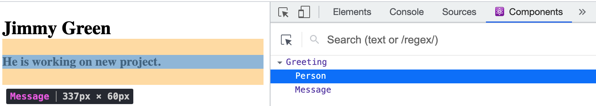

# React Basics

## A functional component

1. to define a function which return JSX (or html code)
2. to render the function as a component using ReactDom.render() method

## JSX

- how to use JSX

```javascript
/*
1. set up a component function
2. render it in DOM using ReactDom.render() method
*/

import React from "react";
import ReactDom from "react-dom";

// function Greeting() {
//   // a react component with capitalized name
//   // stateless functional component => always return JSX
//   return (
//     <div>
//       <h4>Hello World.</h4>
//     </div>
//   );
//   // 1. this is not html but some kind of function wrapped by React (JSX)
//   // 2. the bracket is to formatting html code
// }

const Greeting = () => {
  return React.createElement(
    "div",
    {},
    React.createElement("h1", {}, "H1 headings"),
  ); // nested JSX
};

// two things: 1) what is going to render 2) where to render it
ReactDom.render(<Greeting></Greeting>, document.getElementById("root"));
```

- JSX rules

return a single element, all elements must be encapsulated in an element not two;

using semantic html tags like, section, article or React.Fragment(like div in html);

attributes in html tags use camelCase in React, class => className, onclick => onClick;

close every element,  = > ;

using parentheses for formatting => return ();

- Nested components

```javascript
// nested components, react tools
function Greeting() {
  return (
    <div>
      {/* <h2>John Doe</h2> */}
      {/* <p>This is my message.</p> */}
      <Person />
      <Message />
    </div>
  );
}

const Person = () => <h2>Jimmy Green</h2>;
const Message = () => {
  return <h4>He is working on new project.</h4>;
};
```

This structure can be found if the react-develop-tool is installed in browser


## CSS

## JSX - CSS

in JSX, type the {} which means it goes back to JavaScript. Inside of the curly brackets, it's always JavaScript syntax. Just like following example:

```javascript
const Author = () => (
  <h4 style={{ color: "#dd901a", fontSize: "10px" }}>Osamu Dazai</h4>
);
```

It is a kind of inline CSS

## JSX - JavaScript

{} can be used in JSX for dynamically using variables to pass values not hard coding. Javascript functions will be available as well.

```javascript
const title = "No Longer Human";
const author = "Osamu Dazai";

const Book = () => {
  return (
    <article className='book'>
      
      <h1>{title}</h1>
      <h4>{author}</h4>
    </article>
  );
};
```

## Props

Components using JSX is a kind of functions, we pass arguments in JS functions to do value manipulation.
So, the same thing occurred for components, `props` is an **object** for passing arguments to components.

for components, using the `props` as argument name. Wherever the component is used, passing variables like HTML attributes, these will be properties in the `props` variable:

```javascript
function BookList() {
  return (
    <section className='booklist'>
      <Book job='developer' /> // put job property in props
      <Book title='random title' number={33} />
    </section>
  );
}

const Book = (props) => {
  // variables called props
  console.log(props);

  return (
    <article className='book'>
      
      <h1>{title}</h1>
      <h4>{author.toUpperCase()}</h4>
    </article>
  );
};
```

If the props doesn't have a specific property, it won't display, not side effects.

## Props - children

the children props are anything that defines between openning and closing tag of the component.

```javascript
function BookList() {
  return (
    <section className='booklist'>
      <Book
        img={firstBook.img}
        author={firstBook.author}
        title={firstBook.title}>
        <p>
          {" "}
          // will be saved in children property Lorem ipsum <a href=''>dolor</a>,
          sit amet consectetur adipisicing elit. Sint, mollitia voluptatibus dignissimos
          nisi ipsum voluptatem facilis iusto autem voluptate? Itaque libero nobis
          cumque, nihil mollitia aperiam error iste consequatur quae.
        </p>
      </Book>
      <Book
        img={secondBook.img}
        title={secondBook.title}
        author={secondBook.author}
      />
    </section>
  );
}

const Book = (props) => {
  const { img, title, author, children } = props; // children

  return (
    <article className='book'>
      
      <h1>{title}</h1>
      <h4>{author}</h4>
      {children} // to show children vars on page
    </article>
  );
};
```

objects are not valid react children, it is a kind of html tags or JSX components. Arrays (Strings) can be wrapped or rendering in JSX

list in react, every item should have a unique identity, which is key value.
also, spread operator can be used in JSX tags as props object with the expected values.

## Events in React

1. attribute in JSX for components
2. eventHandler
