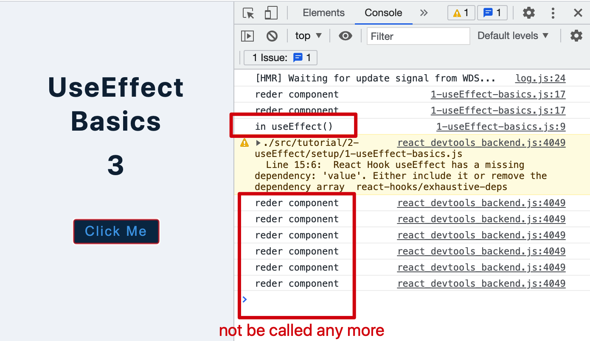
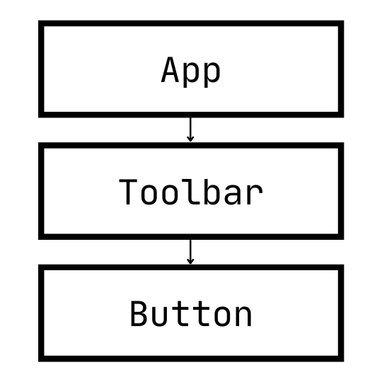

# React Hooks and Advanced Topics

## General rules of hooks

name: useXXX,
declaration: must be in the funtion component body;
`...` spread operator with objects ;
cannot put hooks in conditional statement;

[Why is setState in reactjs Async instead of Sync?](https://stackoverflow.com/questions/36085726/why-is-setstate-in-reactjs-async-instead-of-sync)
This is because setState alters the state and causes rerendering. This can be an expensive operation and making it synchronous might leave the browser unresponsive.

## `useState()`

preserve data between render and then trigger re-render

```javascript
// console.log(useState); // 1. useState is a function
// returns an Array with two values => 2. (2) [undefined, ƒ]

// 3. the firsr parameter is the initial value that will be changes;
// console.log(useState(4));

// const val = useState("OOP")[0]; // initial value
// const func = useState("OOP")[1]; // a handler will control the value
// console.log(val, func);

// 4. using destructing to put in one line.
const [text, setText] = useState("OOP");
```

if the new state is computed using the previous state, you can pass a function to setState.
The function will receive the previous value, and return an updated value[src](https://reactjs.org/docs/hooks-reference.html#functional-updates).

```javascript
const complextIncrease = () => {
  setTimeout(() => {
    //   setCounter(counter + 1); // setState is aysnc function. so, after all sync statement is done, async will perform based on previous status value
    setCounter((prevState) => {
      // in this case, the prevState will get current one
      return prevState + 1;
    });
  }, 2000);
};
```

## `useEffect()`

The function passed to useEffect will run after the render is committed to the screen. By default, effects run after every completed render, but you can choose to fire them only when certain values have changed.

[In useEffect, what's the difference between providing no dependency array and an empty one?](https://stackoverflow.com/questions/58579426/in-useeffect-whats-the-difference-between-providing-no-dependency-array-and-an)

- Giving it an empty array acts like componentDidMount as in, it only runs once.
- Giving it no second argument acts as both componentDidMount and componentDidUpdate, as in it runs first on mount and then on every re-render.
- Giving it an array as second argument with any value inside, eg , [variable1] will only execute the code inside your useEffect hook ONCE on mount, as well as whenever that particular variable (variable1) changes.

[Tip: Optimizing Performance by Skipping Effects ](https://reactjs.org/docs/hooks-effect.html#tip-optimizing-performance-by-skipping-effects)

> In the example above, we pass [count] as the second argument. What does this mean? If the count is 5, and then our component re-renders with count still equal to 5, React will compare [5] from the previous render and [5] from the next render. Because all items in the array are the same (5 === 5), React would skip the effect. That’s our optimization.

side effect - work that outside the componets, Data fetching, setting up a subscription, and manually changing the DOM in React components are all examples of side effects.

By default, `useEffect()` runs after every render the DOM, the key implementation in `useEffect()` is the inside callback function; so when the setState() is called the useEffect() is also triggered since there is re-render

Dependency List, second parameter, it is an array that contains all dependencies. it means when the variables change the useEffect() will be run.

- empty array means useEffect() only run at the intial render, then will not be invoked.

```javascript
useEffect(() => {
  console.log("in useEffect()");
  if (value > 1) {
    // hooks cannot be put in conditional statement
    // but can contain it
    document.title = `New Messages(${value})`;
  }
}, []);
```



- no second parameter means it will run each time of re-render

beware of infinity loop that in useState and useEffect if no second parameter

Cleanup function,the function will be invoked once the useEffect was executed. it's important when components showing or disappearing.

[轻松学会 React 钩子：以 useEffect() 为例](https://www.ruanyifeng.com/blog/2020/09/react-hooks-useeffect-tutorial.html)

## Form in React

### Controlled inputs

// JS
// const input = document.getElementById('myText');
// const inputValue = input.value
// React
// value, onChange

two ways to submit data in react forms:
-- `<form className="form" onSubmit={handleSubmit}>` set onSubmit event on a form, or
-- `<button type="submit" onClick={handleSubmit}>add person</button>` set a type of submit button for click event

to control input's value you must have the value attribute references some of the state and onChange event handler:

```javascript
<input
  type="text"
  id="firstName"
  name="firstName"
  value={firstName}
  onChange={(e) => setFirstName(e.target.value)} // event is using to get the input's value
/>
```

### uncontrolled inputs - useRef

// similar with useState, it preserves value for any html nodes as long as it sets the ref attributes
// DOES NOT trigger re-render
// the key result is to target DOM nodes/elements

It holds a mutable value in its `.current` property, providing a way to access the DOM.

```javascript
<input type="text" ref={refContainer} />;

const refContainer = useRef(null);

console.log(refContainer.current);
```

the object property current `refContainer.current` is the input DOM element, like JS, to use .value to get the input text value.

`useRef` does not trigger re-render, so in `useEffect` we don't need to worry about the second parameter.

## [useReducer](https://reactjs.org/docs/hooks-reference.html#usereducer)

render method and initialState is defined outside of the main component

An alternative to `useState`. Accepts a reducer of type `(state, action) => newState`, and returns the current state paired with a dispatch method.

`const [state, dispatch] = useReducer(reducer, initialArg, init);`

`useReducer` is usually preferable to `useState` when you have complex state logic that involves _multiple sub-values_ or when the next state depends on the _previous one_. `useReducer` also lets you optimize performance for components.
`dispatch` function identity is stable and won’t change on re-renders. This is why it’s safe to omit from the `useEffect` or `useCallback` dependency list. `dispatch({type: 'TESTING'});` in a dispatch(), an object with property type, normally the value is in uppercase, which is used as action name

to initialize useReducer state:

- to pass the initial state as a second argument or
- pass an init function as the third argument.

A reducer method takes two things:

- `state`, before the update, and
- `action`, what action you want to do
  From a reducer, you must always return some kind of state

useReducer will find the reducer functiont that will manipulate state according the action to return new state once we call the dispatch() method.

## Prop Drilling

more components
fix - context api, redux(for moew complex cases)

Prop drilling is the process in a React app where props are passed from one part of a tree to another by going through other parts that do not need the data, but only help in passing it through the tree.



## useContext()

You can think of React context as the equivalent of global variables for our React components. So the creation is outside of the components.

There are four steps to using React context[src](https://www.freecodecamp.org/news/react-context-for-beginners/#what-is-react-context):

- 1. Create context using the `createContext` method.
- 2. Take your created context and wrap the context provider around your component tree.
- 3. Put any value you like on your context provider using the `value` prop.
- 4. Read that value within any component by using the context consumer.

A global context usage, in a context.js file:

```javascript
import React, { useState, useContext } from "react";
// step 1
const AppContext = React.createContext();

// step 2
const AppProvider = ({ children }) => {
  // step 3
  // hooks and functions that needs to put in value
  const [showSidebar, setShowSidebar] = useState(false);
  const [showModal, setShowModal] = useState(false);

  const sidebarHandler = () => {
    setShowSidebar(!showSidebar);
  };

  const modalHandler = () => {
    setShowModal(!showModal);
  };

  return (
    // step 3
    <AppContext.Provider value="HELLO">{children}</AppContext.Provider>
  );
};

// custom hook to encapsulate the useContext() where it needs
const useGlobalContext = () => {
  return useContext(AppContext);
};

export { AppContext, AppProvider, useGlobalContext };
```

then in index.js, to use the component to wrap the App component

```javascript

import { AppProvider } from './context'


// step 2
ReactDOM.render(
  <React.StrictMode>
    <AppProvider>
      <App />
    </AppProvider>
  </React.StrictMode>,
  document.getElementById('root')

```

in other component file:

```javascript
import React from "react";
import { FaBars } from "react-icons/fa";
import { useGlobalContext } from "./context"; // step 4

const Home = () => {
  const { sidebarHandler, modalHandler } = useGlobalContext(); // step 4

  return (
    <main>
      <button className="sidebar-toggle" onClick={sidebarHandler}>
        <FaBars />
      </button>
      <button className="btn" onClick={modalHandler}>
        show modal
      </button>
    </main>
  );
};

export default Home;
```

## Custom Hooks

When we want to **share logic** between two JavaScript functions, we extract it to a third function. Both **components and Hooks** are functions, so this works for them too!.

A custom Hook is a JavaScript _function_ whose name starts with _”use”_ and that may call other Hooks.

Unlike a React component, a custom Hook doesn’t need to have a specific signature. We can decide what it takes as arguments, and what, if anything, it should return. In other words, it’s just like **a normal function**. Its name should always start with _use_ so that you can tell at a glance that the rules of Hooks apply to it.

## React router

the 3rd party component for planning path and corresponding pages.

1. import components:

```javascript
// react router
import { BrowserRouter as Router, Route, Switch } from "react-router-dom";
```

2. define the routes with path and switch

```javascript

<Router>
  <Switch> => only match the first shown path
    <Route exact path="/"> => exact prop will match the exactlly the same path
      <HomePageCompoment />
    <Route path="/about">
      <AboutPageCompoment />
    <Route path="*">
      <ErrorPageComponent>
    </Switch>
</Router>

```

3. to use Link component do navigation

```javascript

<Router>
  <Navbar />
  <Switch> => only match the first shown path
    <Route exact path="/"> => exact prop will match the exactlly the same path
      <HomePageCompoment />
    <Route path="/about">
      <AboutPageCompoment />
    <Route path="*">
      <ErrorPageComponent>
    </Switch>
</Router>

```

in navigation component

```javascript
import { Link } from "react-router-dom";

<nav>
  <ul>
    <li>
      <Link to="/">Home</Link> => Link component with to props
    </li>
    <li>
      <Link to="/about">About</Link>
    </li>
    <li>
      <Link to="/people">People</Link>
    </li>
  </ul>
</nav>;
```

4. to deal with url parameters

1) go with `children` props, we will grab the `id` and fetch the data to show in that `<Person></Person>` component.

```javascript
<Route path="/people/:id" children={<Person></Person>}></Route>
```

2. to set up the link where it will be clicked to the route.

```javascript
<Link to={`/people/${person.id}`}>See details</Link>
```

3. grab the id value and use it to fetch proper data to show on the `<Person></Person>` component.

```javascript
const { id } = useParams(); // => grab the id value

useEffect(() => {
  const newPerson = data.find((item) => item.id === parseInt(id));
  setName(newPerson.name);
}, []);
```

## PropTypes

prop-types allow us to validate the props.

```javascript
import React from "react";

// 1) import the library
import PropTypes from "prop-types";

import defaultImage from "../../../assets/default-image.jpeg";

const Product = (props) => {
  const { image, price, name } = props;
  console.log(image, price, name);

  return (
    <article className="product">
      {/* single item */}
      
      <h4>{name}</h4>
      <p>${price}</p>
    </article>
  );
};

// 2) set the propTypes after the component definition.
Product.propTypes = {
  image: PropTypes.object.isRequired,
  name: PropTypes.string.isRequired,
  price: PropTypes.number.isRequired,
};

// 3) set default values for the props if necessary
Product.defaultProps = {
  image: { url: defaultImage },
  price: 0.0,
  name: "default name",
};

export default Product;
```

## React.memo()

tracked on props change

every time _props or state_ changes, component re-renders ==> useState / useEffect

to keep optimize the memory, if the props or state don't change, just use the previous one => memorize

to use `React.memo()` to wrap the component like this

```javascript
const BigList = React.memo(({ products }) => {
  console.log("big list ");
  return (
    <section className="products">
      {products.map((product) => {
        return <SingleProduct key={product.id} {...product}></SingleProduct>;
      })}
    </section>
  );
});
```

## useCallback()

tracked on dependencies change, it the dependencies don't change it won't re-create the function from scratch.

`useCallback` will return a memoized version of the callback that only changes if one of the _dependencies has changed_. This is useful when passing callbacks to optimized child components that rely on **reference equality to prevent unnecessary renders** (e.g. shouldComponentUpdate).

`useCallback(fn, deps)` is equivalent to `useMemo(() => fn, deps)`.

`useEffect` runs after every render (unless specified differently in dependency array) and `useCallback` “remembers” the function so that the function need not run from scratch. Essentially they both perform totally different functionality

[How To Remove useEffect ESLint Warnings in React](https://betterprogramming.pub/why-eslint-hates-your-useeffect-dependencies-react-js-560fcac0b1f)

Conclusion

    Always specify every variable that is used in the dependency array.
    Functions and variables that change on every re-render without any condition will cause a useEffect loop.
    If you need to use a function created inside the component as a dependency, wrap it in a useCallback. useMemo is the equivalent of useCallback for values that are not functions.

Some tips

    It is also a good idea to use useCallback for functions and useMemo for non-primitive values that are passed to child components. This ensures that the children do not re-render or run their own Hooks when unnecessary.
    You can abstract away some Hook logic inside your own custom Hooks. This will make the code modular, reusable, and easier to manage. However, that is a topic for another time.

## useMemo()

the useMemo() deals with values, it is looking for the value change.

`useMemo` will only recompute the memoized value when one of the dependencies has changed. This optimization helps to avoid expensive calculations on every render. Remember that the function passed to useMemo runs during rendering

I prefer Styled-Components,React-Icons and straight up CSS (no libraries). That way I feel, I'm less dependent on the external libraries, and also at this point straight up CSS offers more flexibility.
