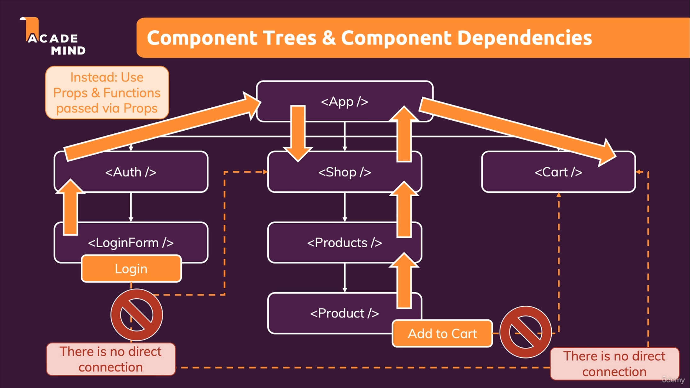

# React - Hooks - useContext

Official documentation: [useContext](https://reactjs.org/docs/hooks-reference.html#usecontext)

[https://www.youtube.com/watch?v=5LrDIWkK_Bc](https://www.youtube.com/watch?v=5LrDIWkK_Bc)

[https://www.youtube.com/watch?v=v5bCFM8kZO8](https://www.youtube.com/watch?v=v5bCFM8kZO8)

[https://www.youtube.com/watch?v=ZBZ6BqoUDsU](https://www.youtube.com/watch?v=ZBZ6BqoUDsU)

[https://www.youtube.com/watch?v=sP7ANcTpJr8](https://www.youtube.com/watch?v=sP7ANcTpJr8)

## Introduce useContext hook

`useContex`t hook is used **to create common data that can be accessed throughout the component hierarchy without passing the props down manually to each level** . State should be held by the highest parent component in the stack that requires access to the state, and `useContext` makes it easily to share state between deeply nested components.



## Applying useContext

- create a context object

  ```typescript
  interface Context {
    name: string;
    age: number;
  }

  const UserContext = createContext<Context>({} as Context);
  ```

- wrap children components

  ```typescript
  const UserProvider: React.FC = ({ children }) => {
    const [users, setUsers] = React.useState([]);

    return (
      <UserContext.Provider
        value={{
          users,
          setUsers,
        }}
      >
        {children}
      </UserContext.Provider>
    );
  };
  ```

  now, all children components in this tree will have access to the user Context

- make a custom hook to encapulate the context where it needs

  ```typescript
  const useUserGlobalContext = () => {
    return React.useContext(UserContext);
  };

  export { UserContext, UserProvider, useUserGlobalContext };
  ```

- apply the context provider to the root of the component

  ```typescript
  <UserProvider>
    <RootComponent />
  </UserProvider>
  ```

- call the context varaibles in children component

  ```typescript
  export const ChildComponent = () => {
    ...

    const { users, setUsers } = useUserGlobalContext();

    return <></>;
  };
  ```

## Context limitations

> It is NOT optimized for high frequency changes (Reduc)

Redux will be introduced for high frequency purpose

> It shouldn't be used to replace ALL component communications and props

Component should still be configurable via props and short props chains might not need replacement by context
